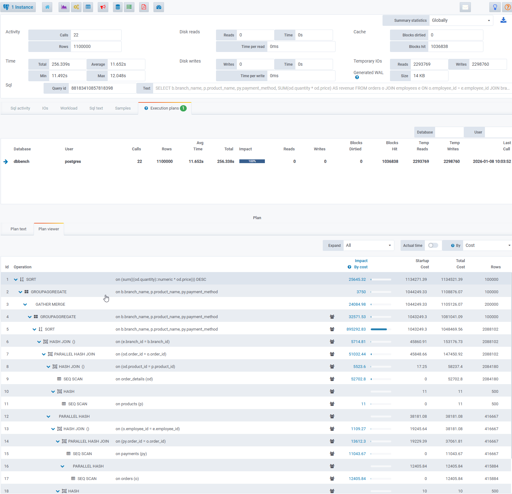

## Overview

It is a fork from [**http://github.com/ossc-db/pg_store_plans**](http://github.com/ossc-db/pg_store_plans) with changes.

`pg_store_plans` provides a means to store execution plans of statements in PostgreSQL.  
This fork includes specific modifications and fixes maintained by [**Datasentinel**](https://www.datasentinel.io).


## Features

- **Plan tracking**: captures and stores distinct execution plans per SQL statement, identified by `(userid, dbid, queryid, planid)`, exposing per-plan statistics similar to `pg_stat_statements`.
- **Plan ID fingerprinting**: plan IDs are computed via a jumble algorithm (structure-based, ignores constants), so the same logical plan maps to the same ID regardless of parameter values.
- **Anonymization**: replace literal constants in stored plan expressions with `?` via `pg_store_plans.anonymize`.
- **Relation tracking**: `relids` column (`oid[]`) lists the base relations accessed by each plan (up to 48 OIDs per entry).
- **Command type**: `cmd_type` column identifies the SQL command (`SELECT`, `INSERT`, `UPDATE`, `DELETE`, `MERGE`, `UTILITY`, `UNKNOWN`).
- **Simple insert filtering**: `pg_store_plans.exclude_simple_inserts` suppresses high-frequency value-list inserts to reduce noise.
- **In-flight query visibility** (PostgreSQL 18+): plan entries are created eagerly at `ExecutorStart` so actively running queries appear in the view with `calls = 0` and `NULL` timestamps before execution completes. Combined with the [`pg_datasentinel`](https://github.com/datasentinel/pg_datasentinel) extension, `ds_stat_activity` can retrieve the live execution plan of any active session.
- **PostgreSQL version support**: compatible with PostgreSQL 14, 15, 16, 17, and 18.


## Releases

| Version | Date | Description |
| :--- | :--- | :--- |
| 2.0.1 | 2026-03-31 | Anonymize, sticky entries and relids |

#### Changes
* Introduce `pg_store_plans.anonymize` to replace constants in stored plan expressions with `?`, preventing sensitive literal values from appearing in the view.
* On PostgreSQL 18, plan entries are created eagerly at `ExecutorStart` (before execution completes) so that in-flight queries are visible with `calls = 0`. `first_call` and `last_call` are `NULL` for such pending entries. To retrieve the current execution plan of active sessions, use the [`pg_datasentinel`](https://github.com/datasentinel/pg_datasentinel) extension and its `ds_stat_activity` view.
* Add `relids` column (`oid[]`): the array of OIDs of base relations accessed by the plan, extracted from the query's range table. At most 48 relations are recorded per entry; `NULL` when no base relations are present.
* Add `cmd_type` column (`text`): the type of the SQL command that produced the plan. Possible values are `SELECT`, `INSERT`, `UPDATE`, `DELETE`, `MERGE` (PostgreSQL 15+), `UTILITY`, and `UNKNOWN`.

| Version | Date | Description |
| :--- | :--- | :--- |
| 2.0 | 2026-01-19 | Fork updates |

#### Changes
* Improve performance by changing the way plan IDs are computed (computed using the jumble method, similar to the queryid).
* Add compatibility with PostgreSQL **14, 15, 16, 17** and the latest **18** release.
* Introduce `pg_store_plans.exclude_simple_inserts` to filter out simple `INSERT` statements (e.g., value-list inserts) to reduce noise from high-frequency, low-value plans.

#### Fixes
* Fix memory leak when reading plan text from file.
* Add a null check when reading the plan from file.


## Installation

### Unpack the source code
```
tar xvzf pg_store_plans.tar.gz
cd pg_store_plans
```

### Build and install the module
```
make
sudo make install
```

## Parameters

> <br>
>
> Add **pg_store_plans** to **shared_preload_libraries** parameter  (requires a server restart)  
> <br>

### Configuration


| Parameter | Type | Default | Description |
| :--- | :--- | :--- | :--- |
| `pg_store_plans.track` | enum | top | - Possible values are: `top`, `all`, `none`, `verbose` <br>Similarly to pg_stat_statements, `pg_store_plans.track` controls which statements are counted by the module. <br>Specify `top` to track top-level statements, `all` to also track nested statements (such as statements invoked within functions except for some commands), or `none` to disable statement statistics collection. <br>When all is specified, the commands executed under CREATE EXTENSION and ALTER EXTENSION commands are still ignored. <br>Specify `verbose` to track all commands including ones excluded by all. Only superusers can change this setting. |
| `pg_store_plans.max` | integer | 1000 | Maximum number of plans tracked by the module (i.e., the maximum number of rows in the pg_store_plans view). If more distinct plans than that are observed, information about the least-executed plan is discarded. The default value is 1000. This parameter can only be set at server start |
| `pg_store_plans.max_plan_length` | integer | 5000 | Maximum byte length of plans in the raw (shortened JSON) format to store. The plan text is truncated at the length if it is longer than that value. This parameter can only be set at server start
| `pg_store_plans.plan_storage` | enum | file | - Possible values are: `file`, `shmem`  <br> Specifies how plan texts are stored while server is running. If it is set to `file`, the plan texts are stored in a temporary file as pg_stat_statements does. `shmem` means to store plan texts on-memory. |
| `pg_store_plans.save` | boolean | on | Specifies whether to save plan statistics across server shutdowns. <br>If it is `off` then statistics are not saved at shutdown nor reloaded at server start. This parameter can only be set in the postgresql.conf file or on the server command line.
| `pg_store_plans.anonymize` | boolean | off | Replace constants in stored plan expressions with `?`. Useful to prevent sensitive literal values from appearing in the `plan` column of `pg_store_plans`. The plan ID is not affected. |

### Filtering

| Parameter | Type | Default | Description |
| :--- | :--- | :--- | :--- |
| `pg_store_plans.exclude_simple_inserts` | boolean | off | Exclude simple `INSERT` statements containing raw values or arrays of values. This prevents flooding the view with high-frequency, low-value insert plans often generated by applications. |


### Instrumentation

| Parameter | Type | Default | Description |
| :--- | :--- | :--- | :--- |
| `pg_store_plans.log_analyze` | boolean | off | causes `EXPLAIN ANALYZE` output, rather than just `EXPLAIN` output, to be included in plan.
| `pg_store_plans.log_buffers`  | boolean | off | causes `EXPLAIN (ANALYZE, BUFFERS)` output, rather than just `EXPLAIN` output, to be included in plan.
| `pg_store_plans.log_timing` | boolean | true | Disables to record actual timings. The overhead of repeatedly reading the system clock can slow down the query significantly on some systems, so it may be useful to set this parameter to `false` when only actual row counts, and not exact execution times for each execution nodes, are needed. <br>Run time of the entire statement is always measured when pg_store_plans.log_analyze is `true`.
| `pg_store_plans.log_triggers` | boolean | false | This parameter has no effect unless pg_store_plans.log_analyze is turned `on`.<br>Causes trigger execution statistics to be included in recoreded plans. 
| `pg_store_plans.verbose` | boolean | false | causes `EXPLAIN VERBOSE` output, rather than just `EXPLAIN` output, to be included in plan.


## pg_store_plans view description

The `pg_store_plans` view exposes aggregated execution plan statistics collected by the extension, in a format similar to `pg_stat_statements`, but with the plan text attached.

Each row represents a distinct observed plan for a statement, identified by the `(userid, dbid, queryid, planid)` key.

Timing and I/O counters are aggregated across all calls for the same key; `first_call` and `last_call` indicate when the plan was first and most recently observed. On PostgreSQL 18, entries may appear with `calls = 0` (created eagerly at query start); `first_call` and `last_call` are `NULL` for such pending entries.

Example:
```sql
SELECT queryid, planid, calls, total_time, mean_time
FROM pg_store_plans
ORDER BY total_time DESC
LIMIT 20;
```

### Columns

|        Column         |           Type |           
| :--- | :--- | 
 userid                | oid                      
 dbid                  | oid                      
 queryid               | bigint                   
 planid                | bigint                   
 plan                  | text                     
 calls                 | bigint                   
 total_time            | double precision         
 min_time              | double precision         
 max_time              | double precision         
 mean_time             | double precision         
 stddev_time           | double precision         
 rows                  | bigint                   
 shared_blks_hit       | bigint                   
 shared_blks_read      | bigint                   
 shared_blks_dirtied   | bigint                   
 shared_blks_written   | bigint                   
 local_blks_hit        | bigint                   
 local_blks_read       | bigint                   
 local_blks_dirtied    | bigint                   
 local_blks_written    | bigint                   
 temp_blks_read        | bigint                   
 temp_blks_written     | bigint                   
 shared_blk_read_time  | double precision         
 shared_blk_write_time | double precision         
 local_blk_read_time   | double precision         
 local_blk_write_time  | double precision         
 temp_blk_read_time    | double precision         
 temp_blk_write_time   | double precision         
 first_call            | timestamp with time zone
 last_call             | timestamp with time zone
 relids                | oid[]
 cmd_type              | text


### Examples

> **Note:** Queries that join `relids` against `pg_class` and `pg_namespace` to resolve relation names must be run in the **same database** where the target tables reside. OIDs in `relids` are local to each database and are only meaningful in that database's catalog. The `pg_store_plans` extension catalog must also be created in that database (`CREATE EXTENSION pg_store_plans`).

**Find the slowest SELECT plans:**

```sql
SELECT
    p.queryid,
    p.planid,
    p.calls,
    p.mean_time,
    p.total_time,
    p.plan
FROM pg_store_plans p
WHERE p.cmd_type = 'SELECT'
ORDER BY p.mean_time DESC
LIMIT 20;
```

**Find all tracked plans that access a specific table:**

```sql
SELECT
    p.queryid,
    p.planid,
    p.calls,
    p.mean_time,
    p.plan
FROM pg_store_plans p
WHERE EXISTS (
    SELECT 1
    FROM unnest(p.relids) AS r(oid)
    JOIN pg_class c ON c.oid = r.oid
    JOIN pg_namespace n ON n.oid = c.relnamespace
    WHERE n.nspname = 'public'
      AND c.relname = 'my_table'
)
ORDER BY p.mean_time DESC;
```

**Join with `pg_stat_statements` to correlate plans with query text and accessed relations:**

```sql
SELECT
    s.query,
    n.nspname                         AS schema_name,
    c.relname                         AS relation_name,
    c.relkind                         AS relation_type,
    p.calls,
    p.mean_time
FROM pg_store_plans p
JOIN pg_stat_statements s
    ON s.queryid = p.queryid
   AND s.userid  = p.userid
   AND s.dbid    = p.dbid
CROSS JOIN unnest(p.relids) AS r(oid)
JOIN pg_class c ON c.oid = r.oid
JOIN pg_namespace n ON n.oid = c.relnamespace
ORDER BY p.mean_time DESC;
```

**Count distinct plans per relation to identify heavily planned tables:**

```sql
SELECT
    n.nspname                         AS schema_name,
    c.relname                         AS relation_name,
    c.relkind                         AS relation_type,
    count(*)                          AS plan_count,
    sum(p.calls)                      AS total_calls
FROM pg_store_plans p
CROSS JOIN unnest(p.relids) AS r(oid)
JOIN pg_class c ON c.oid = r.oid
JOIN pg_namespace n ON n.oid = c.relnamespace
GROUP BY n.nspname, c.relname, c.relkind
ORDER BY total_calls DESC;
```

The `relkind` values follow PostgreSQL conventions: `r` = table, `i` = index, `v` = view, `m` = materialized view, `p` = partitioned table, `f` = foreign table.

**Using [`pg_datasentinel`](https://github.com/datasentinel/pg_datasentinel.git) — show the execution plan of each active session with its accessed relations:**

The `ds_stat_activity` view (provided by the `pg_datasentinel` extension) extends `pg_stat_activity` with `memory_bytes`, `temp_bytes`, and `plan_id` (the current plan being executed by the backend, available on PostgreSQL 18+).

```sql
SELECT
    a.pid,
    a.usename,
    a.datname,
    a.state,
    a.query,
    a.memory_bytes,
    a.temp_bytes,
    n.nspname                         AS schema_name,
    c.relname                         AS relation_name,
    c.relkind                         AS relation_type,
    p.plan
FROM ds_stat_activity a
JOIN pg_store_plans p
    ON  p.planid  = a.plan_id
    AND p.queryid = a.query_id
    AND p.dbid    = a.datid
    AND p.userid  = a.usesysid
CROSS JOIN unnest(p.relids) AS r(oid)
JOIN pg_class c ON c.oid = r.oid
JOIN pg_namespace n ON n.oid = c.relnamespace
WHERE a.state = 'active'
ORDER BY a.memory_bytes DESC NULLS LAST;
```

**Show distinct relations touched by currently active sessions (without plan detail):**

```sql
SELECT DISTINCT
    a.pid,
    a.usename,
    a.datname,
    n.nspname                         AS schema_name,
    c.relname                         AS relation_name,
    c.relkind                         AS relation_type,
    a.memory_bytes,
    a.temp_bytes
FROM ds_stat_activity a
JOIN pg_store_plans p
    ON  p.planid  = a.plan_id
    AND p.queryid = a.query_id
    AND p.dbid    = a.datid
    AND p.userid  = a.usesysid
CROSS JOIN unnest(p.relids) AS r(oid)
JOIN pg_class c ON c.oid = r.oid
JOIN pg_namespace n ON n.oid = c.relnamespace
WHERE a.state = 'active'
ORDER BY a.pid, schema_name, relation_name;
```


## Datasentinel Integration

[](https://www.datasentinel.io)


When combined with **Datasentinel**, execution plans are automatically collected and available in the UI, empowering users to:

*   **Visualize** plans by query over time and correlate them with performance metrics.
*   **Inspect** plans in multiple formats:
    *   **Text**: Standard `EXPLAIN`-style output.
    *   **Structured Tree View**: A custom hierarchical table for analysis.
*   **Identify** plan changes and make informed optimization decisions.

For detailed instructions on configuration, see [**How to configure and integrate pg_store_plans**](https://docs.datasentinel.io/manual/features/other-features/execution-plans).

### Interactive Demo

[](https://app.arcade.software/share/UKahLWSZwrYLpOYUvkDG)
